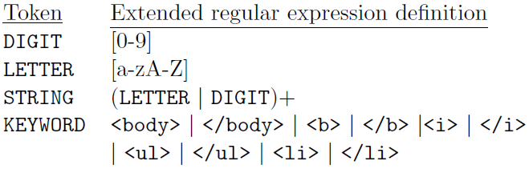

## Notes on the Problem.

This one seems hard. (_not if you decompose the problem._)

_"I Know, I'll use REGEX for this!"_ 

### A REGEX lexer! Yes!

But __Do not use this code.__ Why? Well, [Commander Pike](https://en.wikipedia.org/wiki/Rob_Pike) once wrote in: 
[Regular expressions in lexing and parsing](https://commandcenter.blogspot.com/2011/08/regular-expressions-in-lexing-and.html)

> Comments extracted from a code review. I've been asked to disseminate them more widely.
> 
> I should say something about regular expressions in lexing and parsing. Regular expressions are hard to write, hard to write well, and can be expensive relative to other technologies. (Even when they are implemented correctly in N*M time, they have significant overheads, especially if they must capture the output.) Lexers, on the other hand, are fairly easy to write correctly (if not as compactly), and very easy to test. Consider finding alphanumeric identifiers. It's not too hard to write the regexp (something like "[a-ZA-Z_][a-ZA-Z_0-9]*"), but really not much harder to write as a simple loop. The performance of the loop, though, will be much higher and will involve much less code under the covers. A regular expression library is a big thing. Using one to parse identifiers is like using a Mack truck to go to the store for milk. And when we want to adjust our lexer to admit other character types, such as Unicode identifiers, and handle normalization, and so on, the hand-written loop can cope easily but the regexp approach will break down.
>
> A similar argument applies to parsing. Using regular expressions to explore the parse state to find the way forward is expensive, overkill, and error-prone. Standard lexing and parsing techniques are so easy to write, so general, and so adaptable there's no reason to use regular expressions. They also result in much faster, safer, and compact implementations.
>
> Another way to look at it is that lexers and parsing are matching statically-defined patterns, but regular expressions' strength is that they provide a way to express patterns dynamically. They're great in text editors and search tools, but when you know at compile time what all the things are you're looking for, regular expressions bring far more generality and flexibility than you need.
> 
> Finally, on the point about writing well. Regular expressions are, in my experience, widely misunderstood and abused. When I do code reviews involving regular expressions, I fix up a far higher fraction of the regular expressions in the code than I do regular statements. This is a sign of misuse: most programmers (no finger pointing here, just observing a generality) simply don't know what they are or how to use them correctly. Encouraging regular expressions as a panacea for all text processing problems is not only lazy and poor engineering, it also reinforces their use by people who shouldn't be using them at all.
> 
>So don't write lexers and parsers with regular expressions as the starting point. Your code will be faster, cleaner, and much easier to understand and to maintain.

_Thus, really, don't do it._

```java
// javac Lexer.java && java Lexer

import java.util.ArrayList;
import java.util.regex.Pattern;
import java.util.regex.Matcher;

public class Lexer {
    private static enum Token {
        NUMBER("-?[0-9]+"), OPERATOR("[*|/|+|-]"), SKIP("[ \t\f\r\n]+");

        private final String pattern;

        private Token(String pattern) {
            this.pattern = pattern;
        }
    }

    private static class Word {
        private Token token;
        private String lexeme;

        private Word(Token token, String lexeme) {
            this.token = token;
            this.lexeme = lexeme;
        }

        @Override
        public String toString() {
            return String.format("%-10s => [%s]", token.name(), lexeme);
        }
    }

    private static ArrayList<Word> lex(String input) {
        // The tokens to return
        ArrayList<Word> words = new ArrayList<Word>();

        // Lexer logic begins here
        StringBuffer tokenPatternsBuffer = new StringBuffer();
        for (Token token : Token.values())
            tokenPatternsBuffer.append(String.format("|(?<%s>%s)", token.name(), token.pattern));
        Pattern tokenPatterns = Pattern.compile(new String(tokenPatternsBuffer.substring(1)));

        // Begin matching tokens
        Matcher matcher = tokenPatterns.matcher(input);
        while (matcher.find()) {
            for (Token token : Token.values())
                if (matcher.group(token.name()) != null) {
                    words.add(new Word(token, matcher.group(token.name())));
                    continue;
                }
        }
        return words;
    }

    public static void main(String[] args) {
        String input = "11 + 22 - 33";

        ArrayList<Word> words = lex(input);
        for (Word word : words)
            System.out.println(word);
    }
}
```

A java lexer, for a simple problem like this, should be a straight-forward set of loops.

## ENUMs? a Loop?

Yes, this is commonly an ENUM opportunity.

In order to do this, a Token Class needs to be built, 
with enum types of DIGIT, LETTER, STRING, KEYWORD, EOI, and INVALID. 
These can be extracted from the following definitions of tokens.
This table is described by REGEXs, but is trivially implemented in loops.




From the Token Class: 

```java
public enum TokenType {
    DIGIT, LETTER, STRING, KEYWORD, EOI, INVALID,
}

private TokenType type;
private String val;

public Token (TokenType t, String v) {
    type = t;
    val = v;
}
public TokenType getTokenType () {
// Return token type
    return type;
}
public String getTokenValue () {
// Return value
    return val;
}
```

Once the token class is created, a lexicographic analyzer is needed to take the input string 
and turn it into a sequence of tokens. 
The heart of the lexer, is the next token method, which returns the token 
which corresponds to the next sequence of characters. 
In order to accomplish this, other helper methods are used, to consume input. 
These methods are _greedy_ and attempt to consume as much input as possible and 
still produce a valid token. 
If they fail to produce a valid token, an INVALID token is returned. EOI mean End Of Input.

```java
    public Token getNextToken() {
        do {
            if (ch == '\0') {
                // Return EOI;
                return new Token(Token.TokenType.EOI, "EOI");
            } else if (isLBracket(ch)) {
                // its an HIML tag
                ch = nextChar();
                // Check if its a closing tag
                boolean closingTag = isClosingTag(ch);
                String keyword;
                if (closingTag) (
                        ch = nextChar();
                // Check if it is a valid keyword
                keyword = isValidHTMLTag (ch, closingTag);
                ch = nextChar() ;
                if (keyword != null) {
                    // Valid token
                    return new Token(Token.TokenType.KEYWORD, keyword);
                }
                // Invalid token
                return new Token(Token.TokenType.INVALID, "Invalid keyword!");
            } else if (Character.isLetter(ch)) {
                // Build the string
                String string = concat(letters + digits);
                return new Token(Token.TokenType.STRING, string);
            } else if (Character.isDigit(ch)) {
                // Build the digits
                String num = concat(digits);
                return new Token(Token.TokenType.DIGIT, num);
            } else if (Character.isWhitespace(ch)) {
                // Remove whitespace
                ch = nextChar();
            } else {
                // Character outside of set, so skip it and return invalid
                // This prevents the infinite loop
                ch = nextChar():
                return new Token(Token.TokenType.INVALID, "");
            }
        } while (true);
    }
```
Or something like that. (Oh, look, an infinite loop!)

You will want to write a bit of test harness for this method (and the help methods you need to write).
The test harness should isolate the `getNextToken()` method and just have it operate on a single string.
The test harness might look like:

```java
class Lexer {
    
    class TestNextToken {
        char[] buffer = [];
        int idx = -1;
        int maxlen = 0;
        char ch;
        private char nextChar() {
            idx++;
            if (idx >= maxlen) return '\0';
            return buffer[idx];
        }
        public boolean testGetNextToken(Lexer lexer, String teststring, TokenType target) {
            Boolean isValid = false;
            buffer = teststring.toCharArray();
            maxlen = teststring.length();
            
            Token actual = lexer.getNextToken();
            
            if (actual.getTokenType() == target) return true;
            return false;
        }
    }
}
```

This way, you can carve out a small amount of code to test, without having to run the whole thing.
You can probably figure out a way to do this with UNIT TESTs, but I leave that for you.

You would use the above class something like:

```java
// inside of a test method,
    TestNextToken testharness = new TestNextToken();

//...
        testResult = testharness.testGetNextToken(lexer, "<html>", TokenType.KEYWORD);
        testResult = testharness.testGetNextToken(lexer, "<li>", TokenType.KEYWORD);
        testResult = testharness.testGetNextToken(lexer, "</ul>", TokenType.KEYWORD);
        testResult = testharness.testGetNextToken(lexer, "hello", TokenType.STRING);
        testResult = testharness.testGetNextToken(lexer, "hello12", TokenType.STRING);
        testResult = testharness.testGetNextToken(lexer, "12345", TokenType.DIGIT);
// ad infinitum...
```

